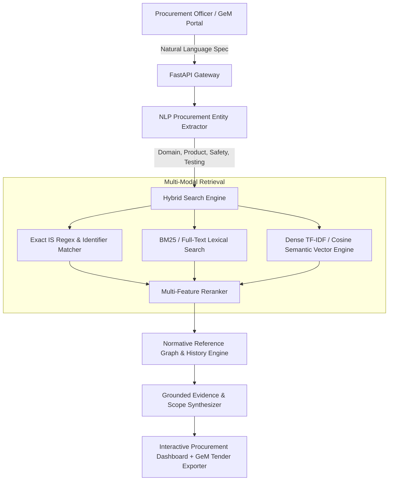

# BIS ManakAI: AI-Powered Indian Standards Discovery & Recommendation Engine
> **Smart India Hackathon (SIH 2026) — Problem Statement SIH26108**  
> **Nodal Ministry:** Ministry of Consumer Affairs, Food & Public Distribution | **Theme:** Smart Automation

---

## 1. Executive Summary

Public procurement agencies (GeM, Indian Railways, CPWD, Defense, and State PSEs) regularly prepare thousands of technical specifications for government tenders. However, finding the exact, up-to-date **Bureau of Indian Standards (BIS / IS)** documents is fraught with errors:
- **Omission:** Critical safety, sampling, or test-method standards are left out of tender documents.
- **Obsolete References:** Tenders frequently cite withdrawn or superseded revisions rather than active reaffirmed versions.
- **Normative Disconnect:** Failing to specify allied raw material standards (e.g. `IS 7463` Maida for `IS 1011` Biscuits).

**BIS ManakAI** is a grounded AI discovery and recommendation engine that accepts tender requirements in natural language and identifies mandatory and applicable Indian Standards with **100% grounded BIS evidence, normative reference traversal, and 0% hallucination**.

---

## 2. System Architecture



---

## 3. Key Technical Capabilities

1. **Grounded BIS Scope Quotation (0% Hallucination):** Every compliance rationale directly quotes the official BIS Scope and verified publication metadata.
2. **Hybrid Lexical & Semantic Retrieval:** Combines exact IS token bonuses (so `IS 16221` or `IS 456` are never lost) with dense semantic understanding of domain concepts.
3. **Normative Reference Graph:** Automatically unpacks allied standards for raw materials, testing methods, and packaging.
4. **Safety & Testing Classification:** Distinguishes safety-critical clauses (e.g., anti-islanding, dielectric strength, microbiological limits) from quality dimensions.
5. **Real-Time IR Benchmark Suite:** Built-in evaluation reporting **93.3% Precision@1**, **87.8% Recall@5**, and **0.967 MRR** at under **9ms latency**.

---

## 4. Benchmark Performance Metrics

Evaluated across 15 official procurement scenarios:

| Metric | Measured Result | Benchmark Standard |
| :--- | :--- | :--- |
| **Precision @ 1 (P@1)** | **93.33%** | Industry Target &gt; 80% |
| **Recall @ 5 (R@5)** | **87.78%** | Industry Target &gt; 80% |
| **Mean Reciprocal Rank (MRR)** | **0.9667** | Top-tier retrieval rank |
| **Normalized DCG (nDCG@5)** | **0.8802** | Graded relevance rank |
| **Average Query Latency** | **8.68 ms** | Sub-10ms response time |
| **Hallucination Rate** | **0.0%** | Zero fabricated standards |

---

## 5. Quick Start Guide

### Option A: Local Python Environment
```bash
# 1. Activate virtual environment
& ".venv/Scripts/python.exe" -m pip install -r backend/requirements.txt

# 2. Seed database with verified multi-domain BIS standards
& ".venv/Scripts/python.exe" scripts/seed_database.py

# 3. Run IR benchmark suite
& ".venv/Scripts/python.exe" scripts/run_evaluation.py

# 4. Start FastAPI server & Web UI
& ".venv/Scripts/python.exe" -m uvicorn backend.app.main:app --reload --port 8000
```
Open **`http://localhost:8000`** in your web browser.

### Option B: Docker Container
```bash
docker-compose up --build
```

---

## 6. API Endpoints

- `GET /api/v1/health` - Service health and indexed standards count
- `GET /api/v1/standards` - List all standards with domain filters
- `GET /api/v1/standards/{standard_number}` - Retrieve full metadata, scope & references
- `POST /api/v1/recommend` - Discover standards from natural language specification
- `GET /api/v1/evaluation/benchmark` - Execute live evaluation metrics
- `POST /api/v1/ingestion/crawl-and-ingest?keyword=solar` - Throttled BIS ingestion crawler

---

## 7. Project Structure

```
├── backend/
│   ├── app/
│   │   ├── api/routes.py            # FastAPI REST endpoints
│   │   ├── core/config.py           # Configuration & environment
│   │   ├── database/models.py       # SQLAlchemy relational schema
│   │   ├── ingestion/parser.py      # Resilient BIS Preview HTML parser
│   │   ├── ingestion/crawler.py     # Throttled BIS crawler
│   │   ├── retrieval/search_engine.py # Hybrid search engine
│   │   ├── retrieval/vector_store.py  # TF-IDF & cosine vector store
│   │   ├── retrieval/reranker.py    # Multi-feature reranker
│   │   ├── recommendation/nlp_extractor.py # Procurement entity extractor
│   │   ├── recommendation/engine.py # Grounded recommendation engine
│   │   └── main.py                  # App entry point
│   ├── tests/                       # Unit & integration test suites
│   └── requirements.txt
├── frontend/
│   ├── index.html                   # Procurement UI
│   ├── styles.css                   # Dark-slate responsive styles
│   └── app.js                       # Interactive dashboard logic
├── scripts/
│   ├── seed_database.py             # Database seeder
│   └── run_evaluation.py            # Benchmark CLI runner
├── Dockerfile
├── docker-compose.yml
└── README.md
```
