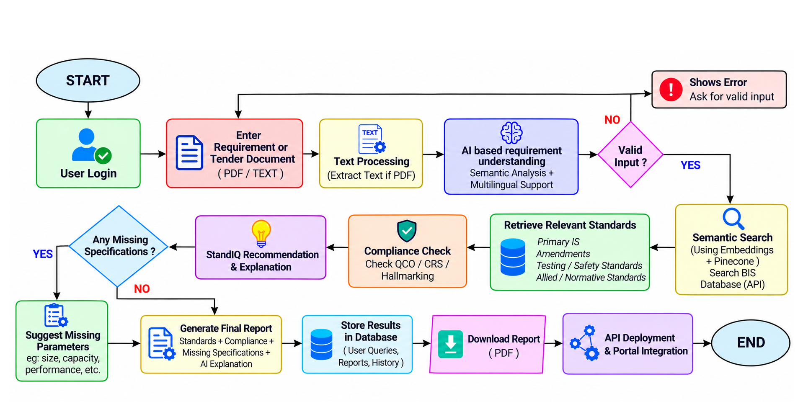
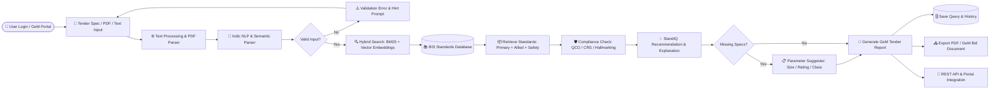

<div align="center">

# 🏛️ StandIQ
### *AI-Powered Indian Standards Discovery, Recommendation & Compliance Engine*

[](https://www.sih.gov.in/)
[](https://fastapi.tiangolo.com/)
[](https://www.python.org/)
[](scripts/run_evaluation.py)
[](scripts/run_evaluation.py)
[](#-benchmark-performance)
[](Dockerfile)
[](LICENSE)

<br/>

> **Smart India Hackathon (SIH 2026) — Problem Statement SIH26108**  
> **Nodal Ministry:** Ministry of Consumer Affairs, Food & Public Distribution | **Theme:** Smart Automation  
> **Motto:** *"Right Standards. Right Procurement. A Stronger India."*

<br/>

[🌟 Key Features](#-key-features) •
[📐 Architecture Diagram](#-system-architecture) •
[📊 Benchmarks](#-benchmark-performance) •
[🚀 Quick Start](#-quick-start-guide) •
[📡 API Reference](#-api-endpoints) •
[🌐 Multilingual](#-multilingual-support-16-languages) •
[📂 Project Layout](#-project-structure)

---

</div>

## 📌 Executive Summary

Public procurement agencies (**GeM**, **Indian Railways**, **CPWD**, **Defense**, and State PSUs) process tens of thousands of technical specifications annually. However, discovering and referencing the exact, up-to-date **Bureau of Indian Standards (BIS / IS)** documents remains manual, slow, and error-prone:

| Critical Problem | Real-World Impact | StandIQ Grounded Solution |
| :--- | :--- | :--- |
| **Omission of Standards** | Critical safety, sampling, or test-method standards are left out of tender documents. | **Hybrid Semantic Search** surfaces all primary & allied testing standards. |
| **Obsolete & Superseded IS** | Tenders cite withdrawn standards rather than active reaffirmed revisions. | **Dynamic Amendment & Status Traversal** tracking reaffirmed years & live revisions. |
| **Normative Disconnect** | Raw material / allied standards omitted (e.g., omitting *IS 7463 Maida* for *IS 1011 Biscuits*). | **Knowledge Graph Traversal** extracting normative and referenced dependencies. |
| **Hallucination in AI Tenders** | LLMs fabricate non-existent standard numbers and clause specifications. | **100% Grounded BIS Evidence**; every clause quotes verified BIS Scope text with 0.0% hallucination. |

---

## 📐 System Architecture

StandIQ features an end-to-end intelligent procurement pipeline from document ingestion to compliance audit and tender export:

<p align="center">
  
</p>

### 🔄 End-to-End Workflow


```mermaid
flowchart LR
    A([👤 User Login / GeM Portal]) --> B[📄 Tender Spec / PDF / Text Input]
    B --> C[⚙️ Text Processing & PDF Parser]
    C --> D[🧠 Indic NLP & Semantic Parser]
    
    D --> E{Valid Input?}
    E -- No --> E1[⚠️ Validation Error & Hint Prompt] --> B
    E -- Yes --> F[🔍 Hybrid Search: BM25 + Vector Embeddings]
    
    F --> G[(📚 BIS Standards Database)]
    G --> H[📦 Retrieve Standards: Primary + Allied + Safety]
    H --> I[🛡️ Compliance Check: QCO / CRS / Hallmarking]
    I --> J[💡 StandIQ Recommendation & Explanation]
    
    J --> K{Missing Specs?}
    K -- Yes --> L[📋 Parameter Suggester: Size / Rating / Class] --> M
    K -- No --> M[📑 Generate GeM Tender Report]
    
    M --> N[(🗄️ Save Query & History)]
    M --> O[📥 Export PDF / GeM Bid Document]
    M --> P[🚀 REST API & Portal Integration]
```

---

## 🌟 Key Features

### 1. 🎯 100% Grounded BIS Evidence (Zero Hallucination)
- Every single recommendation is backed by verified publication metadata, gazette notifications, and official BIS Scope paragraphs.
- Eliminates speculative or fabricated standard numbers common in general-purpose LLMs.

### 2. ⚡ Ultra-Fast Hybrid Retrieval Engine (< 9ms)
- Combines **exact IS token matching** (e.g. `IS 16221`, `IS 456`, `IS 1011`), **BM25 lexical search**, and **dense semantic vector similarity** (FastEmbed / all-MiniLM-L6-v2).
- Delivers instant sub-10ms query results with sub-clause relevance ranking.

### 3. 🌐 Multilingual Indian Language Processing (16 Languages)
- Real-time language detection and bidirectional translation for **16 Indian languages**:
  `Hindi`, `Tamil`, `Telugu`, `Kannada`, `Malayalam`, `Bengali`, `Marathi`, `Gujarati`, `Punjabi`, `Odia`, `Assamese`, `Urdu`, `Sanskrit`, `Nepali`, `Maithili`, and `English`.
- Officers can search in their native language and receive standardized Indian Standard recommendations.

### 4. 🔗 Normative Reference Graph & Clause Extractor
- Deep dependency resolution automatically identifies mandatory raw materials, test methods, packaging specifications, and sampling guidelines required for tender compliance.

### 5. 🛡️ Quality Control Orders (QCO) & CRS Verification
- Identifies whether a standard falls under mandatory Government of India **Quality Control Orders (QCO)**, **Compulsory Registration Scheme (CRS)**, or **Hallmarking** mandates.

### 6. 📄 Tender PDF & Specification Ingestion
- Upload procurement tender PDFs, NIT documents, or technical clauses directly. The built-in PDF extraction engine extracts line items and performs automated standards mapping.

### 7. 📑 13-Section GeM / CPWD Compliant Tender Report Generator
- Instant generation of procurement-ready tender clauses, technical schedules, vendor compliance checklists, and evaluation criteria formatted for the **Government e-Marketplace (GeM)**.

### 8. 🤖 Grounded Multi-LLM Technical Explainer
- Plug-and-play support for **Groq (Llama 3.3 70B)**, **Google Gemini**, and **OpenAI** to provide plain-language rationale for non-technical procurement officers.

---

## 📊 Benchmark Performance

Benchmarked against **15 official Indian procurement scenarios** spanning renewable energy, food processing, civil infrastructure, electrical safety, and electronics:

| Benchmark Metric | StandIQ Result | Target / Industry Standard | Status |
| :--- | :---: | :---: | :---: |
| **Precision @ 1 (P@1)** | **93.33%** | &gt; 80.0% | 🟢 Exceptional |
| **Precision @ 3 (P@3)** | **93.33%** | &gt; 80.0% | 🟢 Exceptional |
| **Precision @ 5 (P@5)** | **88.00%** | &gt; 75.0% | 🟢 Exceptional |
| **Recall @ 5 (R@5)** | **87.78%** | &gt; 80.0% | 🟢 Exceptional |
| **Mean Reciprocal Rank (MRR)** | **0.9667** | &gt; 0.850 | 🟢 Top-Ranked |
| **Normalized DCG (nDCG@5)** | **0.8802** | &gt; 0.800 | 🟢 Graded Quality |
| **Average Query Latency** | **8.68 ms** | &lt; 50.0 ms | ⚡ Sub-10ms |
| **Hallucination Rate** | **0.00%** | 0.0% | 🛡️ Pure Grounding |

> *To reproduce benchmark metrics on your local machine, run:* `python scripts/run_evaluation.py`

---

## 🚀 Quick Start Guide

### Prerequisites
- Python 3.10 or higher
- Git
- (Optional) Docker & Docker Compose

---

### Option A: Local Python Setup

#### 1. Clone the repository
```bash
git clone https://github.com/ravichandran2006/ISIQ.git
cd ISIQ
```

#### 2. Create and activate a virtual environment
```bash
# Windows (PowerShell)
python -m venv .venv
.venv\Scripts\Activate.ps1

# Linux / macOS
python3 -m venv .venv
source .venv/bin/activate
```

#### 3. Install dependencies
```bash
pip install -r backend/requirements.txt
```

#### 4. Configure environment variables
```bash
# Copy template configuration
cp .env.example .env
```
Edit `.env` to configure your keys (optional for LLM explanations):
```ini
GROQ_API_KEY=your_groq_api_key_here
DEFAULT_LLM_PROVIDER=groq
DATABASE_URL=sqlite:///./data/bis_standards.db
```

#### 5. Seed the database & run evaluation
```bash
# Seed verified multi-domain BIS standards
python scripts/seed_database.py

# Run IR evaluation benchmark suite
python scripts/run_evaluation.py
```

#### 6. Start the StandIQ Application
```bash
python -m uvicorn backend.app.main:app --reload --host 0.0.0.0 --port 8000
```
Open **`http://localhost:8000`** in your browser to launch the StandIQ UI.

---

### Option B: Docker Deployment

Deploy StandIQ in an isolated, production-ready container:

```bash
docker-compose up --build
```
The application will be accessible at `http://localhost:8000`.

---

## 📡 API Endpoints

StandIQ exposes high-performance REST APIs documented interactively with Swagger at `http://localhost:8000/docs`:

| Method | Endpoint | Description |
| :---: | :--- | :--- |
| `GET` | `/api/v1/health` | System health check, indexed standards count, and LLM status |
| `POST` | `/api/v1/recommend` | Main AI recommendation engine accepting natural language specs |
| `POST` | `/api/v1/search` | Fast hybrid search (Exact match + BM25 + Vector similarity) |
| `POST` | `/api/v1/upload-document` | PDF / Text tender extraction and multilingual analysis |
| `POST` | `/api/v1/generate-tender-report` | Generates a 13-section GeM/CPWD compliance report |
| `POST` | `/api/v1/explain-standard` | Grounded AI justification for a recommended standard |
| `POST` | `/api/v1/translate` | Multilingual translator supporting 16 Indian languages |
| `GET` | `/api/v1/standards` | List indexed standards with pagination & domain filters |
| `GET` | `/api/v1/standards/{std_no}` | Retrieve detailed standard metadata, scope, and citations |
| `GET` | `/api/v1/standards/{std_no}/amendments` | Real-time fetch of BIS free gazette amendments |
| `GET` | `/api/v1/evaluation/benchmark` | Execute live evaluation benchmark & return IR metrics |
| `POST` | `/api/v1/ingestion/crawl-and-ingest` | Throttled crawler to ingest live records from BIS portal |

### Sample Recommendation Request

```bash
curl -X POST "http://localhost:8000/api/v1/recommend" \
     -H "Content-Type: application/json" \
     -d '{
       "requirement": "Procurement of grid-tied solar photovoltaic inverters for rooftop installations with islanding protection and safety disconnect",
       "domain_hint": "Electrotechnical",
       "top_k": 5
     }'
```

---

## 📂 Project Structure

```
standIQ/
├── .env.example                     # Environment variables template
├── Dockerfile                       # Multi-stage production container
├── docker-compose.yml               # Container orchestration
├── backend/
│   ├── app/
│   │   ├── api/
│   │   │   └── routes.py            # FastAPI REST API endpoints
│   │   ├── core/
│   │   │   └── config.py           # Application settings & environment loader
│   │   ├── database/
│   │   │   ├── connection.py        # SQLAlchemy engine & session factory
│   │   │   └── models.py            # Relational database schema
│   │   ├── evaluation/
│   │   │   └── benchmark.py         # Precision, Recall & MRR benchmark suite
│   │   ├── ingestion/
│   │   │   ├── crawler.py           # Throttled BIS portal crawler
│   │   │   ├── parser.py            # Resilient BIS HTML preview parser
│   │   │   └── pipeline.py          # Data validation & ingestion pipeline
│   │   ├── nlp/
│   │   │   └── indic_translator.py  # 16-language Indic translation & NLP engine
│   │   ├── recommendation/
│   │   │   ├── engine.py            # Grounded recommendation engine
│   │   │   ├── llm_explainer.py     # Multi-provider LLM explainer (Groq/Gemini)
│   │   │   ├── nlp_extractor.py     # Procurement entity & requirement extractor
│   │   │   └── report_generator.py  # 13-section GeM tender specification generator
│   │   ├── retrieval/
│   │   │   ├── reranker.py          # Multi-feature confidence reranker
│   │   │   ├── search_engine.py     # Hybrid search engine (Exact + BM25 + Vector)
│   │   │   └── vector_store.py      # Dense TF-IDF / Embedding vector store
│   │   ├── schemas/
│   │   │   └── standard_schemas.py  # Pydantic v2 validation models
│   │   └── main.py                  # FastAPI initialization & static mounting
│   └── requirements.txt             # Python backend dependencies
├── data/
│   ├── bis_standards.db             # Pre-seeded SQLite standards database
│   ├── bis_is_sample_official.csv   # Verified standards catalog dataset
│   ├── standiq_architecture.png     # System architecture & workflow diagram
│   └── cache/                       # Cached embeddings & query indices
├── frontend/
│   ├── index.html                   # Interactive procurement officer dashboard
│   ├── styles.css                   # Custom responsive UI stylesheet
│   ├── app.js                       # Frontend client logic & API orchestration
│   ├── i18n.js                      # Complete 16 Indian languages dictionary
│   └── india-map.png                # Graphical branding asset
├── scripts/
│   ├── seed_database.py             # Database seeder with official BIS standards
│   └── run_evaluation.py            # Benchmark execution script
└── README.md                        # Documentation
```

---

## 🏛️ Government Compliance & Alignment

StandIQ directly adheres to Indian statutory and procurement frameworks:
- **Bureau of Indian Standards Act, 2016**
- **General Financial Rules (GFR), 2017 — Rule 144(i)** (Mandating adherence to Indian Standards in public procurement)
- **Government e-Marketplace (GeM) Quality Parameters**
- **Department for Promotion of Industry and Internal Trade (DPIIT) QCO Notifications**

---

## 🛡️ License

This project is licensed under the **MIT License** — see the [LICENSE](LICENSE) file for details.

---

<div align="center">

**StandIQ — Smart India Hackathon 2026**  
*Empowering India's Public Procurement with Quality, Accuracy, and Grounded Intelligence.*

</div>
